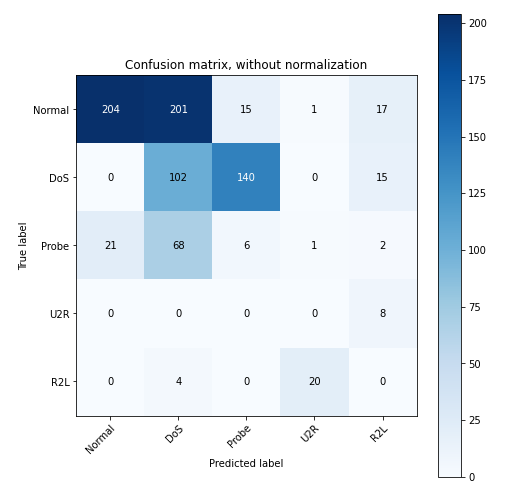
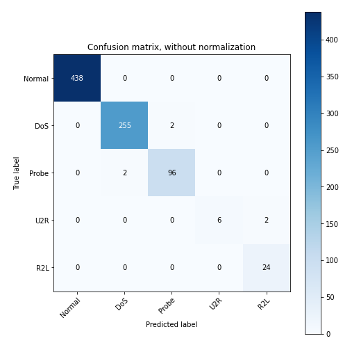
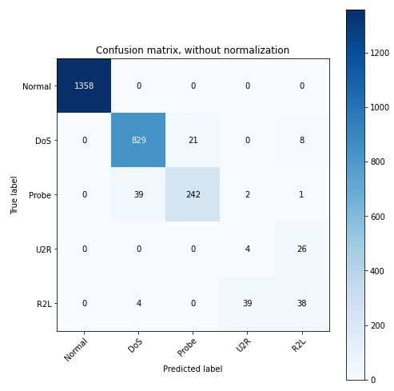

# Adversarial-NSL-KDD

### Objectives
- Implement an ANN model trained on the NSL-KDD dataset (a network attack dataset consisting of network traffic data for 5 classes of attacks).
- Further strengthen the model using adversarial training.
- Evaluate the performance of the models and compare both systems, i.e., the systems which
will be developed with and without adversarial training.

### Evaluating First Model with Adversarial Samples

### Evaluating re-trained Model with Adversarial Samples

### Evaluating First Model with Original Test Samples

